# ESP32 Door Lock Setup Guide

## 📋 Prerequisites

- **Hardware**: ESP32 + AS608 Fingerprint Sensor + Door Lock
- **Software**: Node.js 16+, npm
- **Network**: WiFi network for ESP32 connectivity

## 🚀 Quick Setup

### 1. Install and Configure Server

```bash
# Clone and install
git clone <your-repo>
cd gmgmt
npm install
cd client && npm install && cd ..

# Configure environment
cp env.sample .env
# Edit .env and set:
# ENABLE_BIOMETRIC=true
# BIOMETRIC_PORT=8080
# BIOMETRIC_HOST=0.0.0.0

# Setup database
npm run esp32:setup
```

### 2. Upload ESP32 Firmware

1. Open `esp32_door_lock.ino` in Arduino IDE
2. Update WiFi credentials and server IP:
   ```cpp
   const char* ssid = "YOUR_WIFI_NAME";
   const char* password = "YOUR_WIFI_PASSWORD";
   const char* serverURL = "http://YOUR_SERVER_IP:8080";
   ```
3. Upload to ESP32 device

### 3. Start the System

```bash
# Start server with ESP32 support
npm run start:with-biometric

# The server will start on http://localhost:3001
# Frontend dashboard at http://localhost:3000
```

### 4. Verify Setup

```bash
# Test ESP32 integration
npm run esp32:test

# Check device connectivity
npm run esp32:help
```

## 🔧 ESP32 Device Configuration

### Hardware Connections
- **AS608 Sensor**: RX→Pin16, TX→Pin17, VCC→5V, GND→GND
- **Door Lock**: Relay→Pin18, 12V power supply
- **Status LEDs**: Green→Pin19, Red→Pin21, Blue→Pin22
- **Buzzer**: Pin23
- **Buttons**: Enroll→Pin25, Override→Pin26

#### Connection Diagram

```mermaid
graph TD
    subgraph "ESP32 DevKit"
        ESP32["ESP32"]
        Pin16["Pin 16 (RX)"]
        Pin17["Pin 17 (TX)"]
        Pin18["Pin 18 (Relay)"]
        Pin19["Pin 19 (Green LED)"]
        Pin21["Pin 21 (Red LED)"]
        Pin22["Pin 22 (Blue LED)"]
        Pin23["Pin 23 (Buzzer)"]
        Pin25["Pin 25 (Enroll Btn)"]
        Pin26["Pin 26 (Override Btn)"]
        VCC_5V["5V"]
        VCC_3V["3.3V"]
        GND["GND"]
        VIN["VIN (12V)"]
    end

    subgraph "AS608 Fingerprint Sensor"
        AS608["AS608 Module"]
        AS608_TX["TX"]
        AS608_RX["RX"]
        AS608_VCC["VCC"]
        AS608_GND["GND"]
    end

    subgraph "Door Lock System"
        Relay["Relay Module"]
        DoorLock["Door Lock"]
        PowerSupply["12V Power Supply"]
    end

    subgraph "Status Indicators"
        GreenLED["Green LED<br/>(Access Granted)"]
        RedLED["Red LED<br/>(Access Denied)"]
        BlueLED["Blue LED<br/>(System Ready)"]
        Buzzer["Buzzer<br/>(Audio Feedback)"]
    end

    subgraph "Control Buttons"
        EnrollBtn["Enroll Button<br/>(Add Fingerprint)"]
        OverrideBtn["Override Button<br/>(Manual Open)"]
    end

    %% AS608 Connections
    Pin16 --> AS608_TX
    Pin17 --> AS608_RX
    VCC_5V --> AS608_VCC
    GND --> AS608_GND

    %% Door Lock Connections
    Pin18 --> Relay
    Relay --> DoorLock
    PowerSupply --> DoorLock
    VIN --> PowerSupply

    %% LED Connections
    Pin19 --> GreenLED
    Pin21 --> RedLED
    Pin22 --> BlueLED

    %% Audio Feedback
    Pin23 --> Buzzer

    %% Button Connections
    Pin25 --> EnrollBtn
    Pin26 --> OverrideBtn

    %% Power Distribution
    VCC_3V --> GreenLED
    VCC_3V --> RedLED
    VCC_3V --> BlueLED
    VCC_3V --> Buzzer
    VCC_3V --> EnrollBtn
    VCC_3V --> OverrideBtn

    %% Ground Connections
    GND --> GreenLED
    GND --> RedLED
    GND --> BlueLED
    GND --> Buzzer
    GND --> EnrollBtn
    GND --> OverrideBtn

    style ESP32 fill:#e1f5fe
    style AS608 fill:#f3e5f5
    style Relay fill:#fff3e0
    style DoorLock fill:#e8f5e8
    style PowerSupply fill:#ffebee
```


### Device Settings
1. **WiFi**: Connect ESP32 to same network as server
2. **Server IP**: Configure ESP32 to send data to server IP:8080
3. **Device ID**: Set unique device identifier (default: "DOOR_001")
4. **Web Configuration**: Use Settings → General → ESP32 Biometric Reader Configuration to set connection parameters

## 👤 Member Enrollment

### Web Dashboard Method
1. Go to **Biometric** section in the main navigation
2. Select member from "Members without Biometric" list
3. Click "Enroll Fingerprint" and follow the guided enrollment process
4. Or use "Manual Assignment" to link existing device user IDs

### Direct Device Method
1. Press enrollment button on ESP32 device
2. Follow LED/buzzer prompts to scan fingerprint
3. Device will assign user ID automatically

## 📱 Web Interface Features

### Consolidated Biometric Management (`/biometric`)
- Unified fingerprint enrollment with guided process
- Device selection and real-time enrollment monitoring
- Manual member-device linking
- View biometric events and enrollment status

### ESP32 Device Management (`/settings/esp32-devices`)
- View all connected ESP32 devices
- Remote door unlock
- Device status monitoring
- Start remote enrollment

### Real-time Monitor (`/settings/esp32-monitor`)
- Live event stream
- Device health monitoring
- Connection status

### Analytics (`/settings/esp32-analytics`)
- Usage statistics
- Access logs
- Performance metrics

### ESP32 Configuration (`/settings`)
- Configure ESP32 device host and port settings
- Set local listener host and port
- Network configuration with helpful defaults

## 🛠️ Essential Commands

```bash
# Setup and testing
npm run esp32:setup          # Setup database tables
npm run esp32:test           # Run integration tests
npm run esp32:help           # Show all available commands

# Server management
npm run start:with-biometric # Start with ESP32 support
npm run biometric:start      # Start biometric service only
npm run biometric:check      # Check service status
```

## 🔍 Troubleshooting

### Device Not Connecting
- Check WiFi credentials in ESP32 code
- Verify server IP and port (8080)
- Check firewall settings

### Fingerprint Not Working
- Ensure AS608 sensor is wired correctly
- Check sensor power (5V required)
- Verify device user ID mapping in database

### Web Interface Issues
- Ensure both backend (port 3001) and frontend (port 3000) are running
- Check browser console for errors
- Verify ESP32 API endpoints are responsive
- Access ESP32 features through Settings → ESP32 Devices/Monitor/Analytics tabs
- Use Biometric section for unified enrollment management

### Database Issues
```bash
# Reset ESP32 database tables
npm run esp32:setup

# Manual database check
sqlite3 data/data/gmgmt.sqlite
.tables
SELECT * FROM devices;
```

## 📚 Additional Resources

- **API Endpoints**: `/api/biometric/devices/*` for device management
- **Database Schema**: ESP32 devices stored in `devices` table
- **Frontend Components**: ESP32-specific React components in `/client/src/components/ESP32*`
- **Configuration**: Environment variables in `.env` file

## 🎯 Production Deployment

### Security
- Use WPA3 WiFi encryption
- Configure firewall for port 8080
- Set strong device passwords
- Enable HTTPS in production

### Monitoring
- Monitor device connectivity via web dashboard
- Set up alerts for offline devices
- Regular backup of member fingerprint data
- Monitor system performance and logs

---

**For support**: Check troubleshooting section above or review system logs in `/var/log/` or console output.
