# ESP32 Door Lock Setup Guide

## 📋 Prerequisites

- **Hardware**: ESP32 + AS608 Fingerprint Sensor + Door Lock
- **Software**: Node.js 16+, npm
- **Network**: WiFi network for ESP32 connectivity

## 🚀 Quick Setup

### 1. Install and Configure Server

```bash
# Clone and install
git clone <your-repo>
cd gmgmt
npm install
cd client && npm install && cd ..

# Configure environment
cp env.sample .env
# Edit .env and set:
# ENABLE_BIOMETRIC=true
# BIOMETRIC_PORT=8080  # Port where gym server listens for ESP32 data
# BIOMETRIC_HOST=0.0.0.0

# Setup database
npm run esp32:setup
```

### 2. Install Required Arduino Libraries

Before uploading the firmware, install these libraries in Arduino IDE:

**Method 1: Using Arduino IDE Library Manager**
1. Open Arduino IDE
2. Go to **Tools → Manage Libraries...**
3. Search and install the following libraries:
   - `ArduinoJson` by Benoit Blanchon (version 6.x)
   - `Adafruit Fingerprint Sensor Library` by Adafruit

**Method 2: Using Arduino IDE Board Manager**
1. Go to **File → Preferences**
2. Add ESP32 board URL: `https://raw.githubusercontent.com/espressif/arduino-esp32/gh-pages/package_esp32_dev_index.json`
3. Go to **Tools → Board → Boards Manager**
4. Search and install `esp32` by Espressif Systems

### 3. Upload ESP32 Firmware

1. Open `esp32_door_lock.ino` in Arduino IDE
2. Select the correct board: **Tools → Board → ESP32 Arduino → ESP32 Dev Module**
3. Update WiFi credentials and server IP:
   ```cpp
   const char* WIFI_SSID = "YOUR_WIFI_NAME";
   const char* WIFI_PASSWORD = "YOUR_WIFI_PASSWORD";
   const char* GYM_SERVER_IP = "YOUR_SERVER_IP";  // e.g., "192.168.1.100"
   const int GYM_SERVER_PORT = 5005;              // Your BIOMETRIC_PORT from .env
   ```
4. Connect ESP32 to computer via USB
5. Select the correct port: **Tools → Port → (your ESP32 port)**
6. Click **Upload** button
7. **Open Serial Monitor** and set baud rate to **115200** to see status messages
   - You'll see garbled characters first (normal ESP32 boot messages) - ignore these
   - Clear, readable messages will appear after separator lines (`========================================`)

### 4. Start the System

```bash
# Start server with ESP32 support
npm run start:with-biometric

# The server will start on http://localhost:3001
# Frontend dashboard at http://localhost:3000
```

### 5. Verify Setup

```bash
# Test ESP32 integration
npm run esp32:test

# Check device connectivity
npm run esp32:help
```

**Serial Monitor Check:**
- Open Serial Monitor at **115200 baud**
- Look for separator lines (`========================================`)
- Device should show "SYSTEM READY - Waiting for fingerprints"
- ESP32 IP address should be displayed

## 🔧 ESP32 Device Configuration

### Hardware Connections
- **AS608 Sensor**: RX→Pin16, TX→Pin17, VCC→5V, GND→GND
- **Door Lock**: Relay→Pin18, 12V power supply
- **Status LEDs**: Green→Pin19, Red→Pin21, Blue→Pin22
- **Buzzer**: Pin23
- **Buttons**: Enroll→Pin4, Override→Pin5

#### Connection Diagram

```mermaid
graph TD
    subgraph "ESP32 DevKit"
        ESP32["ESP32"]
        Pin16["Pin 16 (RX)"]
        Pin17["Pin 17 (TX)"]
        Pin18["Pin 18 (Relay)"]
        Pin19["Pin 19 (Green LED)"]
        Pin21["Pin 21 (Red LED)"]
        Pin22["Pin 22 (Blue LED)"]
        Pin23["Pin 23 (Buzzer)"]
        Pin4["Pin 4 (Enroll Btn)"]
        Pin5["Pin 5 (Override Btn)"]
        VCC_5V["5V"]
        VCC_3V["3.3V"]
        GND["GND"]
        VIN["VIN (12V)"]
    end

    subgraph "AS608 Fingerprint Sensor"
        AS608["AS608 Module"]
        AS608_TX["TX"]
        AS608_RX["RX"]
        AS608_VCC["VCC"]
        AS608_GND["GND"]
    end

    subgraph "Door Lock System"
        Relay["Relay Module"]
        DoorLock["Door Lock"]
        PowerSupply["12V Power Supply"]
    end

    subgraph "Status Indicators"
        GreenLED["Green LED<br/>(Access Granted)"]
        RedLED["Red LED<br/>(Access Denied)"]
        BlueLED["Blue LED<br/>(System Ready)"]
        Buzzer["Buzzer<br/>(Audio Feedback)"]
    end

    subgraph "Control Buttons"
        EnrollBtn["Enroll Button<br/>(Add Fingerprint)"]
        OverrideBtn["Override Button<br/>(Manual Open)"]
    end

    %% AS608 Connections
    Pin16 --> AS608_TX
    Pin17 --> AS608_RX
    VCC_5V --> AS608_VCC
    GND --> AS608_GND

    %% Door Lock Connections
    Pin18 --> Relay
    Relay --> DoorLock
    PowerSupply --> DoorLock
    VIN --> PowerSupply

    %% LED Connections
    Pin19 --> GreenLED
    Pin21 --> RedLED
    Pin22 --> BlueLED

    %% Audio Feedback
    Pin23 --> Buzzer

    %% Button Connections
    Pin4 --> EnrollBtn
    Pin5 --> OverrideBtn

    %% Power Distribution
    VCC_3V --> GreenLED
    VCC_3V --> RedLED
    VCC_3V --> BlueLED
    VCC_3V --> Buzzer
    VCC_3V --> EnrollBtn
    VCC_3V --> OverrideBtn

    %% Ground Connections
    GND --> GreenLED
    GND --> RedLED
    GND --> BlueLED
    GND --> Buzzer
    GND --> EnrollBtn
    GND --> OverrideBtn

    style ESP32 fill:#e1f5fe
    style AS608 fill:#f3e5f5
    style Relay fill:#fff3e0
    style DoorLock fill:#e8f5e8
    style PowerSupply fill:#ffebee
```


### Device Settings
1. **WiFi**: Connect ESP32 to same network as server
2. **Server Communication**: ESP32 sends data to server on BIOMETRIC_PORT (default: 8080)
3. **Device ID**: Set unique device identifier (default: "DOOR_001")
4. **ESP32 Web Interface**: Available on port 80 (http://ESP32_IP/)
5. **Web Configuration**: Use Settings → ESP32 Devices → Configuration to set connection parameters

## 👤 Member Enrollment

### Web Dashboard Method
1. Go to **Biometric** section in the main navigation
2. Select member from "Members without Biometric" list
3. Click "Enroll Fingerprint" and follow the guided enrollment process
4. Or use "Manual Assignment" to link existing device user IDs

### Direct Device Method
1. Press enrollment button on ESP32 device
2. Follow LED/buzzer prompts to scan fingerprint
3. Device will assign user ID automatically

## 📱 Web Interface Features

### Consolidated Biometric Management (`/biometric`)
- Unified fingerprint enrollment with guided process
- Device selection and real-time enrollment monitoring
- Manual member-device linking
- View biometric events and enrollment status

### ESP32 Device Management (`/settings/esp32-devices`)
- View all connected ESP32 devices
- Remote door unlock
- Device status monitoring
- Start remote enrollment

### Real-time Monitor (`/settings/esp32-monitor`)
- Live event stream
- Device health monitoring
- Connection status

### Analytics (`/settings/esp32-analytics`)
- Usage statistics
- Access logs
- Performance metrics

### ESP32 Configuration (`/settings`)
- Configure ESP32 device host and port settings
- Set local listener host and port
- Network configuration with helpful defaults

## 🛠️ Essential Commands

```bash
# Setup and testing
npm run esp32:setup          # Setup database tables
npm run esp32:test           # Run integration tests
npm run esp32:help           # Show all available commands

# Server management
npm run start:with-biometric # Start with ESP32 support
npm run biometric:start      # Start biometric service only
npm run biometric:check      # Check service status
```

## 🔍 Troubleshooting

### Library Installation Issues
- **ArduinoJson.h not found**: Install `ArduinoJson` library via Arduino IDE Library Manager
- **Adafruit_Fingerprint.h not found**: Install `Adafruit Fingerprint Sensor Library` via Library Manager
- **ESP32 board not found**: Add ESP32 board URL in Preferences and install via Board Manager
- **Compilation errors**: Ensure you're using ArduinoJson version 6.x (not 7.x which has breaking changes)

### Compilation Errors
- **`finger.begin()` void to bool error**: Code has been updated to use `finger.verifyPassword()` for sensor detection
- **`ledcSetup` not declared**: Code includes compatibility layer for both ESP32 Arduino Core 2.x and 3.x
- **ESP32 core version issues**: The code automatically detects and uses the correct API for your Arduino core version

### Serial Monitor Issues
- **Garbled characters at startup** (`��������������������������`): These are normal ESP32 boot messages sent at 74880 baud rate
- **Solution**: Set your Serial Monitor to **115200 baud rate** and ignore the initial garbled text
- **Arduino IDE**: Tools → Serial Monitor → Set baud rate to 115200 (bottom-right dropdown)
- **PlatformIO**: Use `pio device monitor --baud 115200` or set `monitor_speed = 115200` in `platformio.ini`
- **Expected output**: Garbled boot messages followed by clear text after separator lines (`========================================`)
- **Note**: The garbled characters cannot be eliminated - they're hardware-level boot messages and are completely normal

### Device Not Connecting
- Check WiFi credentials in ESP32 code
- Verify server IP and port match your `.env` file (`BIOMETRIC_PORT`)
- Ensure ESP32 code port matches the `BIOMETRIC_PORT` in your `.env` file
- Check firewall settings for the configured port

### Fingerprint Not Working
- Ensure AS608 sensor is wired correctly
- Check sensor power (5V required)
- Verify device user ID mapping in database

### Web Interface Issues
- Ensure both backend (port 3001) and frontend (port 3000) are running
- Check browser console for errors
- Verify ESP32 API endpoints are responsive
- Access ESP32 features through Settings → ESP32 Devices/Monitor/Analytics tabs
- Use Biometric section for unified enrollment management

### Database Issues
```bash
# Reset ESP32 database tables
npm run esp32:setup

# Manual database check
sqlite3 data/data/gmgmt.sqlite
.tables
SELECT * FROM devices;
```

## 📚 Additional Resources

- **API Endpoints**: `/api/biometric/devices/*` for device management
- **Database Schema**: ESP32 devices stored in `devices` table
- **Frontend Components**: ESP32-specific React components in `/client/src/components/ESP32*`
- **Configuration**: Environment variables in `.env` file

## 🎯 Production Deployment

### Security
- Use WPA3 WiFi encryption
- Configure firewall for ports 80 (ESP32 web interface) and 8080 (biometric data)
- Set strong device passwords
- Enable HTTPS in production

### Monitoring
- Monitor device connectivity via web dashboard
- Set up alerts for offline devices
- Regular backup of member fingerprint data
- Monitor system performance and logs

---

**For support**: Check troubleshooting section above or review system logs in `/var/log/` or console output.
