# ESP32 Door Lock Setup Guide

## 📋 Prerequisites

- **Hardware**: ESP32 + AS608 Fingerprint Sensor + Door Lock
- **Software**: Node.js 16+, npm
- **Network**: WiFi network for ESP32 connectivity

## 🆕 New: Environment-Driven Configuration

**Major Update**: ESP32 devices now support **dynamic, environment-driven configuration** instead of hardcoded credentials!

### 🎉 Key Benefits

| **Before** | **Now** |
|------------|---------|
| ❌ WiFi credentials hardcoded in source | ✅ Dynamic configuration via web interface |
| ❌ Recompile & flash for network changes | ✅ Update settings without re-flashing firmware |
| ❌ Credentials visible in source code | ✅ Encrypted storage with password masking |
| ❌ Manual device configuration | ✅ Remote management from gym dashboard |
| ❌ Same firmware needs different versions | ✅ One firmware works across all networks |

### 🔧 Configuration Options

1. **Web Interface**: `http://ESP32_IP/config` - User-friendly configuration form
2. **API Endpoints**: REST API for programmatic configuration
3. **Remote Management**: Configure from gym management system
4. **Development Defaults**: Optional `config.h` file for custom defaults

**Result**: Easier deployment, enhanced security, and simplified management!

## 🚀 Quick Setup

### 1. Install and Configure Server

```bash
# Clone and install
git clone <your-repo>
cd gmgmt
npm install
cd client && npm install && cd ..

# Configure environment
cp env.sample .env
# Edit .env and set:
# ENABLE_BIOMETRIC=true
# BIOMETRIC_PORT=8080  # Port where gym server listens for ESP32 data
# BIOMETRIC_HOST=0.0.0.0

# Setup database
npm run esp32:setup
```

### 2. Install Required Arduino Libraries

Before uploading the firmware, install these libraries in Arduino IDE:

**Method 1: Using Arduino IDE Library Manager**
1. Open Arduino IDE
2. Go to **Tools → Manage Libraries...**
3. Search and install the following libraries:
   - `ArduinoJson` by Benoit Blanchon (version 6.x)
   - `Adafruit Fingerprint Sensor Library` by Adafruit

**Method 2: Using Arduino IDE Board Manager**
1. Go to **File → Preferences**
2. Add ESP32 board URL: `https://raw.githubusercontent.com/espressif/arduino-esp32/gh-pages/package_esp32_dev_index.json`
3. Go to **Tools → Board → Boards Manager**
4. Search and install `esp32` by Espressif Systems

### 3. Upload ESP32 Firmware

1. Open `esp32_door_lock.ino` in Arduino IDE
2. Select the correct board: **Tools → Board → ESP32 Arduino → ESP32 Dev Module**
3. **Configuration Options** (choose one):
   
   **Option A: Use Web Interface** (Recommended)
   - Upload firmware with default settings
   - Configure via web interface after upload (see step 7)
   
   **Option B: Custom Default Configuration**
   ```bash
   # Copy configuration template
   cp esp32_door_lock/config.h.example esp32_door_lock/config.h
   
   # Edit config.h with your preferred defaults:
   # DEFAULT_WIFI_SSID = "YOUR_WIFI_NAME"
   # DEFAULT_WIFI_PASSWORD = "YOUR_WIFI_PASSWORD"  
   # DEFAULT_GYM_SERVER_IP = "YOUR_SERVER_IP"
   # DEFAULT_GYM_SERVER_PORT = 8080
   ```

4. Connect ESP32 to computer via USB
5. Select the correct port: **Tools → Port → (your ESP32 port)**
6. Click **Upload** button
7. **Configure Device** (if using Option A):
   - Open Serial Monitor at **115200 baud** to see device IP
   - Navigate to `http://ESP32_IP/config` in your browser
   - Enter your WiFi credentials and server settings
   - Click "Save Configuration" (device will restart automatically)
8. **Verify Connection**:
   - Check Serial Monitor for WiFi connection success
   - Look for separator lines (`========================================`)
   - Device should show "SYSTEM READY - Waiting for fingerprints"

### 4. Start the System

```bash
# Start server with ESP32 support
npm run start:with-biometric

# The server will start on http://localhost:3001
# Frontend dashboard at http://localhost:3000
```

### 5. Verify Setup

```bash
# Test ESP32 integration
npm run esp32:test

# Check device connectivity
npm run esp32:help
```

**Serial Monitor Check:**
- Open Serial Monitor at **115200 baud**
- Look for separator lines (`========================================`)
- Device should show "SYSTEM READY - Waiting for fingerprints"
- ESP32 IP address should be displayed

## 🔧 ESP32 Device Configuration

### Hardware Connections
- **AS608 Sensor**: RX→Pin16, TX→Pin17, VCC→5V, GND→GND
- **Door Lock**: Relay→Pin18, 12V power supply
- **Status LEDs**: Green→Pin19, Red→Pin21, Blue→Pin22
- **Buzzer**: Pin23
- **Buttons**: Enroll→Pin4, Override→Pin5

#### Connection Diagram

```mermaid
graph TD
    subgraph "ESP32 DevKit"
        ESP32["ESP32"]
        Pin16["Pin 16 (RX)"]
        Pin17["Pin 17 (TX)"]
        Pin18["Pin 18 (Relay)"]
        Pin19["Pin 19 (Green LED)"]
        Pin21["Pin 21 (Red LED)"]
        Pin22["Pin 22 (Blue LED)"]
        Pin23["Pin 23 (Buzzer)"]
        Pin4["Pin 4 (Enroll Btn)"]
        Pin5["Pin 5 (Override Btn)"]
        VCC_5V["5V"]
        VCC_3V["3.3V"]
        GND["GND"]
        VIN["VIN (12V)"]
    end

    subgraph "AS608 Fingerprint Sensor"
        AS608["AS608 Module"]
        AS608_TX["TX"]
        AS608_RX["RX"]
        AS608_VCC["VCC"]
        AS608_GND["GND"]
    end

    subgraph "Door Lock System"
        Relay["Relay Module"]
        DoorLock["Door Lock"]
        PowerSupply["12V Power Supply"]
    end

    subgraph "Status Indicators"
        GreenLED["Green LED<br/>(Access Granted)"]
        RedLED["Red LED<br/>(Access Denied)"]
        BlueLED["Blue LED<br/>(System Ready)"]
        Buzzer["Buzzer<br/>(Audio Feedback)"]
    end

    subgraph "Control Buttons"
        EnrollBtn["Enroll Button<br/>(Add Fingerprint)"]
        OverrideBtn["Override Button<br/>(Manual Open)"]
    end

    %% AS608 Connections
    Pin16 --> AS608_TX
    Pin17 --> AS608_RX
    VCC_5V --> AS608_VCC
    GND --> AS608_GND

    %% Door Lock Connections
    Pin18 --> Relay
    Relay --> DoorLock
    PowerSupply --> DoorLock
    VIN --> PowerSupply

    %% LED Connections
    Pin19 --> GreenLED
    Pin21 --> RedLED
    Pin22 --> BlueLED

    %% Audio Feedback
    Pin23 --> Buzzer

    %% Button Connections
    Pin4 --> EnrollBtn
    Pin5 --> OverrideBtn

    %% Power Distribution
    VCC_3V --> GreenLED
    VCC_3V --> RedLED
    VCC_3V --> BlueLED
    VCC_3V --> Buzzer
    VCC_3V --> EnrollBtn
    VCC_3V --> OverrideBtn

    %% Ground Connections
    GND --> GreenLED
    GND --> RedLED
    GND --> BlueLED
    GND --> Buzzer
    GND --> EnrollBtn
    GND --> OverrideBtn

    style ESP32 fill:#e1f5fe
    style AS608 fill:#f3e5f5
    style Relay fill:#fff3e0
    style DoorLock fill:#e8f5e8
    style PowerSupply fill:#ffebee
```


### Device Settings
1. **WiFi**: Connect ESP32 to same network as server
2. **Server Communication**: ESP32 sends data to server on BIOMETRIC_PORT (default: 8080)
3. **Device ID**: Set unique device identifier (default: "DOOR_001")
4. **ESP32 Web Interface**: Available on port 80 (http://ESP32_IP/)
5. **Web Configuration**: Use Settings → ESP32 Devices → Configuration to set connection parameters

## 👤 Member Enrollment

### Web Dashboard Method
1. Go to **Biometric** section in the main navigation
2. Select member from "Members without Biometric" list
3. Click "Enroll Fingerprint" and follow the guided enrollment process
4. Or use "Manual Assignment" to link existing device user IDs

### Direct Device Method
1. Press enrollment button on ESP32 device
2. Follow LED/buzzer prompts to scan fingerprint
3. Device will assign user ID automatically

## 📱 Web Interface Features

### Consolidated Biometric Management (`/biometric`)
- Unified fingerprint enrollment with guided process
- Device selection and real-time enrollment monitoring
- Manual member-device linking
- View biometric events and enrollment status

### ESP32 Device Management (`/settings/esp32-devices`)
- View all connected ESP32 devices
- Remote door unlock
- Device status monitoring
- Start remote enrollment

### Real-time Monitor (`/settings/esp32-monitor`)
- Live event stream
- Device health monitoring
- Connection status

### Analytics (`/settings/esp32-analytics`)
- Usage statistics
- Access logs
- Performance metrics

### ESP32 Configuration (`/settings`)
- Configure ESP32 device host and port settings
- Set local listener host and port  
- Network configuration with helpful defaults
- Remote configuration of ESP32 devices via API

### ESP32 Web Interface (`http://ESP32_IP/`)
- Direct device configuration and control
- Emergency unlock and enrollment functions
- Real-time status monitoring
- Configuration management (`/config` endpoint)

## 🔧 Configuration Management

The ESP32 door lock system now supports **dynamic, environment-driven configuration** instead of hardcoded credentials. This provides enhanced security, easier deployment, and remote management capabilities.

### Configuration Methods

#### 1. Web Interface Configuration (Recommended)
**Access**: `http://ESP32_IP/config`

The ESP32 provides a built-in web interface for easy configuration:

```
✨ Features:
├── WiFi SSID & Password configuration
├── Server IP & Port settings
├── Device ID customization
├── Real-time WiFi status display
├── Reset to defaults option
├── Automatic restart when needed
└── Input validation and error handling
```

**Usage**:
1. Connect to ESP32's IP address in your browser
2. Navigate to `/config` endpoint
3. Fill in your network and server details
4. Click "Save Configuration"
5. Device automatically restarts to apply changes

#### 2. API Configuration (For Integration)
**Endpoints**:
- `GET /api/config` - Retrieve current configuration
- `POST /api/config` - Update configuration via JSON

**Example API Usage**:
```bash
# Get current configuration
curl http://192.168.1.100/api/config

# Update configuration
curl -X POST http://192.168.1.100/api/config \
  -H "Content-Type: application/json" \
  -d '{
    "wifi_ssid": "NewNetwork",
    "wifi_password": "NewPassword",
    "gym_server_ip": "192.168.1.200",
    "gym_server_port": 8080,
    "auto_restart": true
  }'
```

#### 3. Gym Management System Integration
**Remote Configuration**: Configure ESP32 devices directly from the gym management web interface:
- Navigate to **Settings → ESP32 Devices**
- Select device to configure
- Update network and server settings
- Changes applied remotely via API

#### 4. Configuration Header File (Development)
**Optional**: Create `config.h` for custom development defaults:

```bash
# Copy template
cp esp32_door_lock/config.h.example esp32_door_lock/config.h

# Edit with your defaults
nano esp32_door_lock/config.h
```

### Configuration Storage & Security

#### **Persistent Storage**
- **ESP32 Preferences**: All settings stored in encrypted EEPROM
- **Automatic Loading**: Configuration loaded on every boot
- **Backup Safe**: Settings survive firmware updates and power cycles

#### **Security Features**
- **Password Masking**: Credentials masked in logs (`MyPassword123` → `My*******3`)
- **No Hardcoding**: No credentials stored in source code
- **Secure Transmission**: HTTPS support for production deployments
- **Access Control**: Web interface can be secured with authentication

#### **Configuration Priority**
1. **Saved Preferences** (highest priority - user configured)
2. **config.h Values** (medium priority - developer defaults)
3. **Built-in Defaults** (lowest priority - fallback values)

### Default Configuration Values

When no configuration is saved, the ESP32 uses these safe defaults:

```cpp
WiFi SSID: "ESP32_Setup"
WiFi Password: "configure_me"
Server IP: "192.168.1.101"
Server Port: 8080
Device ID: "DOOR_001"
```

### Migration from Hardcoded Credentials

**If upgrading from an older version**:

1. **Upload New Firmware**: Flash the updated ESP32 code
2. **Initial Boot**: Device starts with safe default values
3. **Configure via Web**: Access `http://ESP32_IP/config` to set your credentials
4. **Verify Connection**: Check serial monitor for successful connection
5. **Clean Up**: Remove any hardcoded credentials from source code

**Benefits of New System**:
- ✅ **No Recompilation**: Change WiFi/server settings without re-flashing
- ✅ **Remote Management**: Configure devices from central dashboard
- ✅ **Enhanced Security**: Encrypted storage and masked logging
- ✅ **Easy Deployment**: Same firmware works across different networks
- ✅ **Troubleshooting**: Detailed connection logs and status reporting

## 🛠️ Essential Commands

```bash
# Setup and testing
npm run esp32:setup          # Setup database tables
npm run esp32:test           # Run integration tests
npm run esp32:help           # Show all available commands

# Server management
npm run start:with-biometric # Start with ESP32 support
npm run biometric:start      # Start biometric service only
npm run biometric:check      # Check service status
```

## 🔍 Troubleshooting

### Library Installation Issues
- **ArduinoJson.h not found**: Install `ArduinoJson` library via Arduino IDE Library Manager
- **Adafruit_Fingerprint.h not found**: Install `Adafruit Fingerprint Sensor Library` via Library Manager
- **ESP32 board not found**: Add ESP32 board URL in Preferences and install via Board Manager
- **Compilation errors**: Ensure you're using ArduinoJson version 6.x (not 7.x which has breaking changes)

### Compilation Errors
- **`finger.begin()` void to bool error**: Code has been updated to use `finger.verifyPassword()` for sensor detection
- **`ledcSetup` not declared**: Code includes compatibility layer for both ESP32 Arduino Core 2.x and 3.x
- **ESP32 core version issues**: The code automatically detects and uses the correct API for your Arduino core version

### Serial Monitor Issues
- **Garbled characters at startup** (`��������������������������`): These are normal ESP32 boot messages sent at 74880 baud rate
- **Solution**: Set your Serial Monitor to **115200 baud rate** and ignore the initial garbled text
- **Arduino IDE**: Tools → Serial Monitor → Set baud rate to 115200 (bottom-right dropdown)
- **PlatformIO**: Use `pio device monitor --baud 115200` or set `monitor_speed = 115200` in `platformio.ini`
- **Expected output**: Garbled boot messages followed by clear text after separator lines (`========================================`)
- **Note**: The garbled characters cannot be eliminated - they're hardware-level boot messages and are completely normal

### Device Not Connecting

#### **WiFi Connection Issues**
- **Web Configuration**: Access `http://ESP32_IP/config` to update WiFi credentials
- **Serial Monitor**: Check for detailed WiFi connection logs at 115200 baud
- **Connection Status**: Look for detailed error messages like `NO_SSID_AVAILABLE`, `WRONG_PASSWORD`, `CONNECT_FAILED`
- **Troubleshooting Tips**: ESP32 automatically displays network troubleshooting suggestions on connection failure

#### **Server Configuration Issues**
- **Port Verification**: Ensure ESP32 server port matches your `.env` file (`BIOMETRIC_PORT=8080`)
- **IP Address**: Verify gym server IP is correct and accessible from ESP32 network
- **API Configuration**: Use `POST /api/config` to update server settings remotely
- **Remote Configuration**: Use gym management system **Settings → ESP32 Devices** to configure devices

#### **Network Access Issues**
- **Firewall**: Check firewall settings for ports 80 (ESP32 web interface) and 8080 (biometric data)
- **Network Restrictions**: Ensure ESP32 can reach gym server (same network or proper routing)
- **WiFi Requirements**: ESP32 only supports 2.4GHz networks (not 5GHz)
- **MAC Filtering**: Check if router has MAC address filtering enabled

#### **Configuration Reset**
If device is completely inaccessible:
```bash
# Option 1: Hardware reset (will restore saved preferences)
# Press ESP32 reset button

# Option 2: Flash firmware with clean configuration
# Upload firmware and configure via web interface

# Option 3: Use serial monitor for debugging
# Connect via USB and check detailed logs at 115200 baud
```

#### **Configuration Debugging**
Check ESP32 logs for configuration details:
```
========================================
Configuration loaded:
  WiFi SSID: YourNetwork
  WiFi Password: Yo****rd (length: 12)
  Server IP: 192.168.1.101
  Server Port: 8080
  Device ID: DOOR_001
========================================
```

### Fingerprint Not Working
- Ensure AS608 sensor is wired correctly
- Check sensor power (5V required)
- Verify device user ID mapping in database

### Web Interface Issues
- Ensure both backend (port 3001) and frontend (port 3000) are running
- Check browser console for errors
- Verify ESP32 API endpoints are responsive
- Access ESP32 features through Settings → ESP32 Devices/Monitor/Analytics tabs
- Use Biometric section for unified enrollment management

### Database Issues
```bash
# Reset ESP32 database tables
npm run esp32:setup

# Manual database check
sqlite3 data/data/gmgmt.sqlite
.tables
SELECT * FROM devices;
```

## 📚 Additional Resources

### API Endpoints
- **Device Management**: `/api/biometric/devices/*` for device management
- **ESP32 Configuration**: 
  - `GET /api/config` - Retrieve device configuration
  - `POST /api/config` - Update device configuration
- **Device Control**:
  - `POST /unlock` - Emergency unlock
  - `POST /enroll` - Start fingerprint enrollment
- **Status Monitoring**: `/status` - Device status and health information

### Configuration Files
- **ESP32 Firmware**: `esp32_door_lock/esp32_door_lock.ino`
- **Configuration Template**: `esp32_door_lock/config.h.example`
- **Documentation**: `esp32_door_lock/README.md` - Detailed configuration guide
- **Environment Variables**: `.env` file for server configuration

### Database Schema
- **ESP32 Devices**: Stored in `devices` table
- **Biometric Data**: Member fingerprint associations
- **Event Logs**: Access and enrollment events

### Frontend Components
- **ESP32 Device Manager**: `/client/src/components/ESP32DeviceManager.js`
- **Monitor Interface**: `/client/src/components/ESP32Monitor.js`
- **Analytics Dashboard**: `/client/src/components/ESP32Analytics.js`
- **Settings Integration**: `/client/src/components/Settings.js`

### Configuration Management
- **Web Interface**: `http://ESP32_IP/config` for device configuration
- **Remote API**: JSON-based configuration updates
- **Persistent Storage**: ESP32 preferences (EEPROM) for settings
- **Security**: Password masking and encrypted storage

## 🎯 Production Deployment

### Security Best Practices

#### **Network Security**
- Use **WPA3 WiFi encryption** for wireless networks
- Configure **firewall rules** for ports 80 (ESP32 web interface) and 8080 (biometric data)
- Implement **network segmentation** for IoT devices
- Use **VPN access** for remote management

#### **Device Security**
- **Strong WiFi Passwords**: Use complex passwords for WiFi networks
- **Device Authentication**: Implement access control for ESP32 web interface
- **Configuration Security**: Leverage encrypted preferences storage
- **Regular Updates**: Keep ESP32 firmware updated with security patches

#### **Data Protection**
- **Password Masking**: All passwords are automatically masked in logs
- **Encrypted Storage**: Device preferences stored in encrypted EEPROM
- **No Hardcoding**: Zero credentials stored in source code
- **Secure Transmission**: Enable HTTPS for production deployments

#### **Access Control**
- **Role-Based Access**: Control who can configure ESP32 devices
- **API Security**: Implement authentication for configuration APIs
- **Physical Security**: Secure access to ESP32 hardware and reset buttons
- **Audit Logging**: Monitor all configuration changes and access attempts

### Configuration Management

#### **Centralized Management**
- **Web Dashboard**: Configure all devices from gym management interface
- **API Integration**: Automate device configuration via REST APIs
- **Bulk Updates**: Update multiple devices simultaneously
- **Configuration Backup**: Export and import device configurations

#### **Deployment Strategy**
```bash
# Step 1: Prepare firmware with production defaults
cp esp32_door_lock/config.h.example esp32_door_lock/config.h
# Edit config.h with production network settings

# Step 2: Deploy firmware to devices
# Upload same firmware to all devices

# Step 3: Configure devices remotely
# Use web interface or API to set device-specific settings

# Step 4: Verify deployment
npm run esp32:test  # Test all device connectivity
```

### Monitoring & Maintenance

#### **Health Monitoring**
- **Device Connectivity**: Monitor device status via web dashboard
- **Performance Metrics**: Track response times and error rates
- **WiFi Signal Quality**: Monitor signal strength and connection stability
- **System Resources**: Track memory usage and uptime

#### **Alerting & Notifications**
- **Offline Devices**: Set up alerts for devices that go offline
- **Configuration Changes**: Monitor unauthorized configuration modifications
- **Security Events**: Alert on suspicious access patterns
- **Maintenance Windows**: Schedule updates during low-usage periods

#### **Data Management**
- **Regular Backups**: Backup member fingerprint data and device configurations
- **Log Rotation**: Manage ESP32 and server log files
- **Performance Monitoring**: Track system performance and optimize as needed
- **Capacity Planning**: Monitor usage patterns for scaling decisions

---

**For support**: Check troubleshooting section above or review system logs in `/var/log/` or console output.
